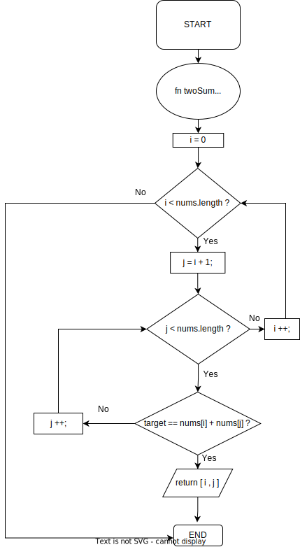
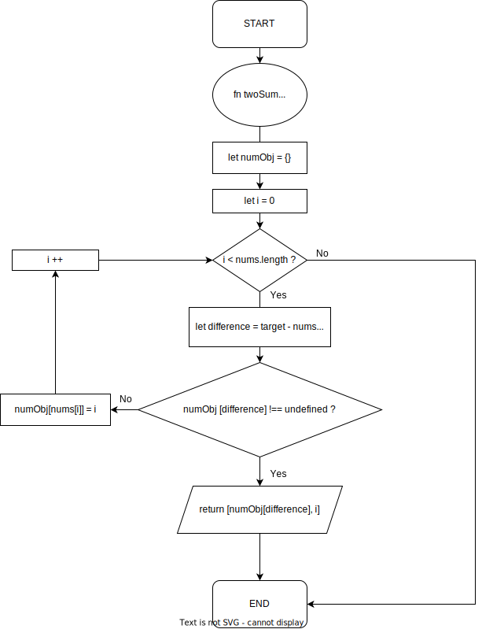

# Algorithm Assignment　
## Leet Code no.1 "Two Sum"

This article is for school task, The detail of the task is below.

The detail of the task is below.

  **Write 1 blog/article about algorithms in any manner, not limited to JavaScript.You can write about objectives or how algorithms solve problems. You can provide information, offer suggestions and advice to a reader who may not know what an algorithm is.
  Writing a script to give examples is also valued and recommended. You may write an article that revolves around the topic of JavaScript.**

***

I don't have any working experience as a developer, have just started learning programming, so with meaning of review and deepen understanding of basic of algorithm, I tried to explain how to solve Leet code no.1 "Two Sum".

Below is the explanation of two sum problem.

**Leet Code Two Sum explanation**  

 ```markdown
 Given an array of integers nums and an integer target, return indices of the two numbers such that they add up to target.
 You may assume that each input would have exactly one solution, and you may not use the same element twice.
You can return the answer in any order.

 Example1
 Input: nums = [2,7,11,15], target = 9
Output: [0,1]
Explanation: Because nums[0] + nums[1] == 9, we return [0, 1]

Example2
Input: nums = [3,2,4], target = 6
Output: [1,2]

Example3
Input: nums = [3,3], target = 6
Output: [0,1]
```

*If you want to read more details about Leet code, Click [here.](https://leetcode.com/problems/two-sum/ "Leet Code -Two Sum")

***

I first thought I needed to use for loop inside for loop to get target value as below code and flowchart, which means looking through all numbers one by one to find indices of the two numbers which they add up to target.

```Javascript
function twoSum (nums, target) {
  for (let i = 0; i < nums.length; i++) {
    for ( let j = i + 1; j < nums.length; j++) {
      if ( target == nums[i] + nums[j] ) return [ i , j ]; 
    }
  }    
}
```




From Big O notation point of view, each complexity is as below.

**Time complexity: $O(n^2)$**

**Space complexity: $O(1)$**

As I said, it works but more numbers in the array, the more it takes to solve.
So, I tried to find more efficient way to solve this problem, but I couldn't. Therefore, I used best friend(the service which start from 'G', not 'C') to find better one.

Point is how to avoid for loop in for loop which cause time complexity to $n^2$ and what I need to do is finding difference of target value and value in the array I am looking at.

Difference = Target - value in array

```Javascript
function twoSum(nums, target) {
 let numObj = {};
   for (let i = 0; i < nums.length; i++) {
     let difference = target - nums[i];
     if (numObj[difference] !== undefined) {
       return [numObj[difference], i];
     }
     numObj[nums[i]] = i;
   }
 }
```


From Big O notation point of view, each complexity is as below.

**Time complexity: $O(n)$**

**Space complexity: $O(n)$**

Here we have tradeoff, improved time complexity at the sacrifice of space complexity.  
Well,,, you can buy space but you can't buy time.

Thanks for reading.
